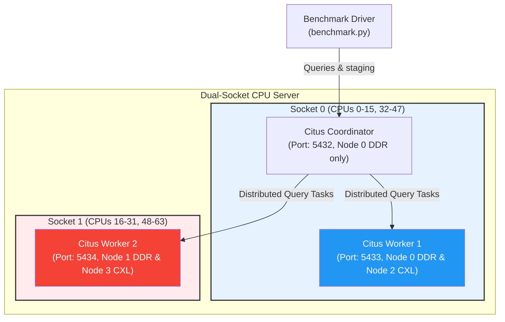

# 📊 Citus TPC-H Multi-Socket CXL Benchmark Architecture Guide

이 문서는 하이닉스의 듀얼 소켓 비대칭 메모리 서버(DDR + CXL) 환경에 최적화된 **Citus TPC-H 벤치마크 환경**의 설계 아키텍처와 상세 실행 가이드입니다. 

---

## 🗺️ 시스템 아키텍처 설계 (System Architecture)

본 벤치마크 환경은 물리적인 듀얼 소켓 토폴로지를 완벽히 대변할 수 있도록 **Citus Coordinator-Worker 아키텍처**로 격리 및 격상하여 구현되었습니다.



### 1) CPU & Memory 리소스 바인딩 맵 (Hardware Pinning)
* **Citus Coordinator**: Socket 0의 CPU 및 **로컬 DDR Node 0 전용**으로 바인딩되어 메타데이터 관리와 분산 쿼리 플래닝만 신속하게 처리합니다.
* **Citus Worker 1 (Socket 0)**: 
  * CPU 바인딩: `0-15,32-47` (Socket 0 물리 코어 전체)
  * Memory 바인딩: `Node 0 (DDR)` + `Node 2 (CXL)`
* **Citus Worker 2 (Socket 1)**: 
  * CPU 바인딩: `16-31,48-63` (Socket 1 물리 코어 전체)
  * Memory 바인딩: `Node 1 (DDR)` + `Node 3 (CXL)`

---

## ⚡ 핵심 아키텍처 특징 (Key Design Highlights)

### 1. Host-Native OCI 투과형 `numactl` 메모리 인젝션
기존 Docker의 `--cpuset-mems` 옵션은 사용할 메모리 노드만 제한할 뿐, 교차 할당 정책(Interleave, Weighted Interleave)을 인가할 수 없습니다. 
본 설계는 호스트의 검증된 `numactl` 바이너리와 `libnuma.so.1`을 컨테이너 내부에 직접 마운트하고, 컨테이너 진입점(`--entrypoint`)에서 `numactl` 명령을 실행해 **커널 수준의 set_mempolicy(MPOL_WEIGHTED_INTERLEAVE 등)를 100% 보장**합니다.

### 2. 스토리지 병목 제거: Pure In-Memory PostgreSQL 설정
저장 매체(SSD/HDD)의 I/O 병목으로 인해 CPU 및 대역폭 성능 측정이 희석되는 것을 방지하기 위해, PostgreSQL 코어 옵션을 실시간 메모리 연산 모드로 튜닝하여 기동합니다.
* `fsync = off` & `synchronous_commit = off`: WAL 디스크 동기화를 완전히 차단하여 메모리 버퍼에서 staging 트랜잭션 종결.
* `autovacuum = off`: 벤치마크 도중 배큠 백그라운드 스레드의 I/O 간섭 차단.
* Dynamic `shared_buffers` 할당:
  * Worker 1 (Socket 0, 352GB 가용): **`shared_buffers = 32GB`**, **`work_mem = 8GB`**
  * Worker 2 (Socket 1, 160GB 가용): **`shared_buffers = 16GB`**, **`work_mem = 4GB`**
  * 대용량 정렬 및 Hash Join 시 메모리 대역폭 한계까지 가압할 수 있도록 대형 버퍼 주입.

### 3. Citus Co-location (동일 노드 분산) 설계
분산 조인 수행 시 네트워크 및 소켓 간 QPI/UPI 링크를 타고 데이터 셔플링(Data Shuffling)이 일어나는 병목을 예방하기 위해, 데이터 스키마 로딩 단계부터 **Co-location** 제약조건을 인가합니다.
* `lineitem` 테이블을 `orders` 테이블과 함께 `l_orderkey`/`o_orderkey` 기준으로 동일 샤드 매핑 (`colocate_with => 'orders'`).
* `partsupp` 테이블을 `part` 테이블과 함께 `ps_partkey`/`p_partkey` 기준으로 동일 샤드 매핑.
* `nation` 및 `region` 테이블은 **Reference Table(완전 복제 테이블)**로 설정하여 모든 Worker에 로컬 카피본을 두어 조인 대역폭 낭비를 0%로 수렴시킵니다.

### 4. Columnar 스토리지 vs Row-based Heap 비교 환경 제공
* **`schema_columnar.sql`**: Citus의 최신 native **Columnar storage (`USING columnar`)** 기법 적용. 쿼리에 활용되지 않는 컬럼의 스캔을 완벽히 생략하고 LZ4/ZSTD 압축 기법을 주입하여 CXL PCIe 링크의 버스 대역폭 낭비를 원천 차단합니다. (OLAP 성능 극대화)
* **`schema_row.sql`**: 기존의 **Row-oriented (heap)** 스토리지 구조. 비교 대조 실험을 통해 Columnar 구조가 CXL 대역폭 보틀넥을 어떻게 해결하는지 수치적으로 증명할 수 있습니다.

---

## 🚀 실전 실행 가이드 (How to Run)

모든 작업은 `/home/sawi/cxl_TPC/benchmark.py` 드라이버를 통해 하나의 라인으로 제어할 수 있습니다.

### 1) 1:1 DDR/CXL 균등 교차 모드 (Interleave)
```bash
python3 /home/sawi/cxl_TPC/benchmark.py -s 1.0 -c columnar -p interleave
```
* `-s 1.0`: Scale Factor 1.0 (약 1GB 데이터 생성 및 로딩)
* `-c columnar`: Columnar 스토리지 모드 활성화
* `-p interleave`: 각 소켓 내부의 DDR과 CXL 메모리에 페이지를 1:1로 고르게 배분

### 2) 3:1 가중치 비대칭 교차 모드 (Weighted Interleave) ⭐ 추천
```bash
python3 /home/sawi/cxl_TPC/benchmark.py -s 1.0 -c columnar -p weighted -w "3:1"
```
* `-p weighted`: 커널 수준의 Weighted Interleave 강제 활성화.
* `-w "3:1"`: DDR에 3페이지 할당될 때 CXL에 1페이지 할당하여 대역폭 비대칭성 최적 조율.

### 3) 로컬 DDR 전용 모드 (Baseline 성능 측정)
```bash
python3 /home/sawi/cxl_TPC/benchmark.py -s 1.0 -c columnar -p ddr-only
```
* CXL 리모트 메모리를 배제하고 로컬 소켓의 초고속 DDR 영역만 인가했을 때의 피크 성능 baseline 확보.

### 4) CXL 전용 모드 (Worst-case 성능 측정)
```bash
python3 /home/sawi/cxl_TPC/benchmark.py -s 1.0 -c columnar -p cxl-only
```
* 모든 데이터와 메모리 버퍼를 PCIe 카드 형태의 CXL 노드에 강제 인가하여, 최대 대역폭 제약 성능 측정.

---

## 📈 Scale-up 확장 방안 (Easy Scale-Up Blueprint)

본 아키텍처는 향후 **더 큰 스펙의 다중 소켓 물리 서버(예: 4-Socket, 8-Socket) 및 초대형 데이터셋**으로 쉽게 확장 가능하도록 설계되어 있습니다.

### 1. Worker 노드 선형 확장 (Cluster Scale-Out)
서버의 소켓 수가 증가하더라도 `run_citus_cluster.sh` 스크립트에 컨테이너 및 CPU/MEM 바인딩 노드 정의만 몇 줄 추가하면 즉시 스케일 아웃이 가능합니다.
* 예: 4-소켓 환경으로 갈 경우, `citus_worker_3` (Socket 2), `citus_worker_4` (Socket 3) 컨테이너 정의 후 Coordinator에서 아래 한 줄로 등록 끝:
  ```sql
  SELECT citus_add_node('citus_worker_3', 5432);
  SELECT citus_add_node('citus_worker_4', 5432);
  ```

### 2. Citus 샤드 파티션 조절을 통한 CPU 병렬도 극대화
현재 스크립트에는 8개의 샤드(`SET citus.shard_count = 8`)로 되어 있습니다. 
더 거대한 CPU 서버로 전환할 시, 스키마 파일(`schema_columnar.sql` / `schema_row.sql`)의 `citus.shard_count`를 **`16` 또는 `32`** 등으로 스케일업해 주십시오. 
Citus가 각 소켓의 CPU 물리 코어 개수에 맞추어 백그라운드 Worker 프로세스를 병렬 실행(Parallel Scan)하므로, 소켓 내부의 모든 코어를 100% 풀로드할 수 있습니다.

### 3. 100GB ~ 1TB 스케일 팩터 가압
벤치마크 실행 시 `-s 10.0` (10GB) 또는 `-s 100.0` (100GB) 등 임의의 대형 인자값만 주면, `benchmark.py` 드라이버가 자동으로 거대 정밀 데이터셋을 단계별로 파이프라이닝 및 자동 로딩 처리합니다.

---

## ⚡ 차세대 초고스펙 서버 (128코어 2S, 12CH Host DDR, 8CH CXL) 대역폭(BW) 가압 전략

소켓당 128코어 및 소켓당 12채널 Host + 8채널 CXL 메모리 버스 환경에서 CPU L3 캐시에 데이터가 히트하여 메모리 버스가 놀아나는 현상을 막기 위해서는 아래 3가지 하드웨어 레벨 가압 설계가 필수적입니다.

### 1. 최소 300GB ~ 1TB 이상으로 스케일 업 (SF 300+)
* 2소켓 256코어 서버의 총 L3 캐시는 최소 **1GB ~ 3.5GB**에 육박합니다. 
* 따라서 Working Set 크기를 최소 캐시 크기의 **200배 이상인 300GB ~ 1TB 스케일 팩터(`-s 300` ~ `-s 1000`)**로 벤치마킹하여 캐시 미스(L3 Cache Miss)를 강제하고, 100% Main Memory(DDR/CXL)에서 페이지를 인출 및 저장하도록 밀어붙여야 합니다.

### 2. Hash Join & Aggregation 메모리 점유 극대화 (`work_mem` 인가)
* TPC-H 쿼리(예: Q1, Q9, Q18 등)는 극도로 무거운 해시 조인(Hash Join)과 그룹화 연산을 동반합니다.
* PostgreSQL/Citus 실행 시, 각 워커의 가용 메모리 대역폭을 모두 짜낼 수 있도록 `work_mem` 파라미터를 소켓당 물리 메모리 여유분에 맞춰 **`16GB` ~ `32GB`** 수준으로 설정해 줍니다. 
* 256개 코어가 각각 수십 기가바이트 크기의 해시 테이블을 메모리에 무작위로 읽고 쓰는 과정에서 **12채널 DDR 및 8채널 CXL 버스는 이론적 한계 대역폭까지 자연스럽게 Saturation(포화)**됩니다.

### 3. 병렬 처리 한계 수치 조정 (PostgreSQL Parallel Tuning)
* 대형 서버 가압 시, `run_citus_cluster.sh`의 Worker 컨테이너 시작 인수에서 다음 파라미터 조정을 통해 128개의 코어가 하나의 쿼리 스캔에 동시에 덤벼들도록 강제합니다.
  ```text
  -c max_parallel_workers_per_gather=64
  -c max_parallel_workers=128
  -c max_worker_processes=256
  ```
* 64개 이상의 병렬 워커가 대용량 Columnar Stripe 블록을 대칭/비대칭 메모리로부터 동시에 긁어올 때, PCIe Gen5/Gen6 CXL 인터페이스의 대역폭 한계 대와 성능 저하 현상을 선명하게 관찰하실 수 있습니다.

